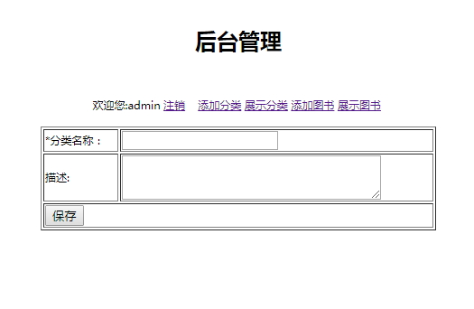
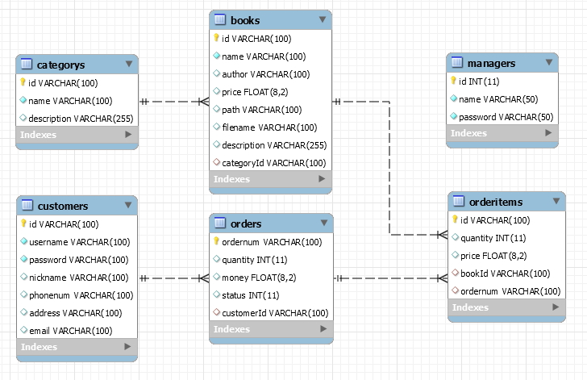

### 使用Spring4.3.9与Mybatis3.4.4的整合框架，实现了一个功能相对齐全的网上书城的JavaWeb项目。

功能如下：  
1. 书城客户端  
	- 图书浏览
	- 图书分类浏览
	- 图书购买
	- 客户注册/登录/注销
	- 客户订单查询

2. 书城后台管理端
	- 管理员登录/注销
	- 图书类型信息的增删改查
	- 上架图书信息的增删改查(包括图片信息）

### 项目界面

一、 客户端主要界面
1. 首页

2. 注册页

3. 登录页

4. 商品分类展示页

5. 图书详情页

6. 购物车页

7. 订单页

二、 后台主要界面
1. 登录

2. 添加图书类别页

3. 展示所有图书类型

4. 添加图书

5. 展示所有图书

三、 数据库设计E-R图

## 存在问题
1. 一些功能有待完善/或实现上不够简洁
3. 项目代码不够模块化，以减少代码重复量